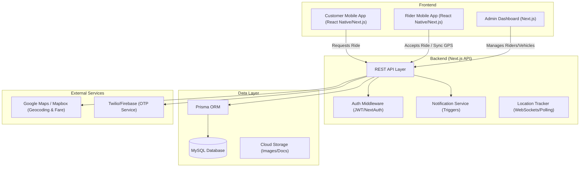

# Kandi System Architecture

This document provides a high-level overview of the Kandi platform architecture, explaining how different components interact to handle ride booking and real-time tracking.

## 1. System Components Diagram

## 2. Key Architecture Layers

### A. Presentation Layer (Frontend)
- **Customer App**: Uses Webhooks/Polling to track rider movement (`LocationLog`). Displays estimates from Maps API.
- **Rider App**: Continuously pushes GPS updates to the server. Handles OTP verification locally and via server checks.
- **Admin Panel**: CRUD for EBikes, Riders, and Customers. View real-time active trips.

### B. Business Logic Layer (Backend)
- **API Routes**: Built using Next.js App Router (e.g., `/api/rider-app`, `/api/customer`).
- **State Machine**: Monitors the `Order` status field transitions (`Pending -> Accepted -> Arrived -> Started -> Delivered`).

### C. Data Layer
- **Persistent Storage**: MySQL stores stateful data.
- **Real-time State**: Current rider location (`lastLat`, `lastLng`) is updated frequently in the `Rider` table for quick lookups.

### D. Rating System Logic
- **Submission**: Once `Order` status becomes `Delivered`, the Customer app shows a rating modal.
- **Storage**: Data is stored in a `Review` table associated with the `Order`, `Customer`, and `Rider`.
- **Aggregation**: Rider's average rating is recalculated in the `Rider` profile.

---

## 3. Data Flow: Ride Booking
1. **Frontend**: Customer selects pickup/drop -> Maps API calculates distance.
2. **Backend**: Fare is calculated based on distance + base rate -> Order created.
3. **Notify**: Broadcast to nearby riders (WebSockets or Polling).
4. **Assignment**: First rider to click 'Accept' gets the ID assigned.
